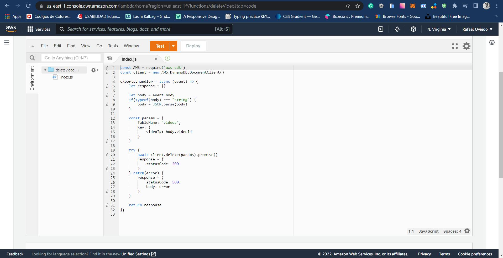

## To build up the project || Para levantar el proyecto
```
-Clone this repository.
-Step into the folder you cloned it.
-Run 'npm install'.
-Once the dependencies have been installed,
run 'npm run serve'.
-Go to http://localhost:8080/

OR you can go to this deployed link:
------------------------------------------------

-Clona este repositorio.
-Parate en la carpeta donde clonaste el proyecto.
-Ejecuta 'npm install'.
-Una vez instaladas las dependencias,
ejecuta 'npm run serve'.
-Ve a http://localhost:8080/

O puedes ir a este enlace también para verlo deployado:
```
https://videos-album.vercel.app/

## As requested || De acuerdo a lo pedido
```
In the home page, you have an input, where you can paste a YouTube link,
and then add it (with the button) to the list displayed below. 

If you exceed 6 videos you can go to the next 'page' with the arrow.
----------------------------------------------------------------------------

En la página de inicio, tendrás un input, donde puedes pegar un link de YouTube,
y luego agregarlo (con el botón) a la lista desplegada abajo.

Si hay más de 6 vídeos puedes pasar a la siguiente 'página' con la flecha.
```

```
If you click in the thumbnail of the video (not the X), you will open a modal,
which will display the information of the video such as Title and Description, and
if you click in the thumbnail again you will be redirected to the internal reproducer.
--------------------------------------------------------------------------------------

Si haces clic en la miniatura del video (no en la X), abrirá un modal,
que mostrará la información del video, como el título y la descripción, y
si vuelves a hacer clic en la miniatura, serás redirigido al reproductor interno.
```

```
In the reproducer you can watch the video and go back to the previous modal.
-----------------------------------------------------------------------------

En el reproductor interno podrás ver el video y retroceder al modal anterior.
```

```
In the video listing, if you click the X button in the upper right arrow on the
thumbnail, you will open the delete modal, with two options, 'cancel' (which will
return you back), or delete, which will delete that video from the Dynamo Database
and you will no longer see it in the list.
------------------------------------------------------------------------------------

En la lista de videos, si haces clic en el botón X en la parte superior derecha de la
miniatura, abrirá el modal para eliminar, con dos opciones, 'cancelar' (que lo cerrará)
o eliminar, que eliminará ese video de la base de datos de DynamoDB
y ya no lo verás en la lista.
```

```
And last (not requested but added as well), a About section where you can see
some extra information and a couple of links to my social media.
I added this because i didn't wanted to let out the vue-router functionality.
--------------------------------------------------------------------------------

Y por último (no solicitado pero agregado también), una sección About donde podrás
ver información extra y un par de links a mis redes sociales.
Agregué esto porque no quería dejar por fuera la funcionalidad de vue-router.
```

```
------------------------------------------------------------------------------
```
## AWS

```
As requested i created a 'videos' table to save the data sent from the
front with the lambda functions.
------------------------------------------------------------------------

Según lo pedido, creé una tabla 'videos' para guardar los datos enviados
desde el front con las funciones lambda.
```

```
If you go to the 'Explore table items' section, you can see that there
is effectively the items stored in the DynamoDB database.
---------------------------------------------------------------------------

Si vas a la sección 'Explore table items', se puede ver que efectivamente
hay elementos almacenados en la base de datos de DynamoDB.
```

```
As you can see in the next image i created three different lambda
functions which will handle the correspondant actions for every need.

-deleteVideo Function
-addVideo Function
-getVideos Function
-----------------------------------------------------------------------------

En la siguiente imagen, creé tres funciones lambda que gestionan las 
acciones correspondientes en cada caso.

-deleteVideo Function
-addVideo Function
-getVideos Function
```

```
The three functions have similar behaviour: 

the deleteVideo function:

-check if the data sent in the body is string to convert to json
-sets a params object with the element to delete
-tries the execution of the delete() method or throws error
----------------------------------------------------------------------

Las tres funciones tienen un comportamiento similar:

la función deleteVideo:

-verifica si los datos enviados en el body son strings y los convierte a json
-crea un objeto params con el elemento a eliminar
-ejecuta el método delete() o arroja un error
```

```
The addVideo function:

-aswell check if the data sent in the body is string to convert to json
-sets a params object with the element to create
-tries the execution of the put() method or throws error
-------------------------------------------------------------------------

La función addVideo:

-también verifica si los datos enviados en el body son strings para
convertirlos a json
-crea un objeto params con el elemento a crear
-intenta la ejecución del método put() o arroja un error
```

```
The getVideos function:

-use the scan() method to check the elements in the table and
returns the data in the body or throws error
----------------------------------------------------------------

La función getVideos:

-usa el método scan() para comprobar los elementos de la tabla y
devuelve los datos en el cuerpo o arroja un error
```

```
And finally those three functions executes in a final endpoint '/videos'
thanks to the API Gateaway in this link:
-----------------------------------------------------------------------

Y finalmente esas tres funciones se ejecutan en una ruta final '/videos'
gracias a la API Gateaway con este link:
```
https://9f36sdoad4.execute-api.us-east-1.amazonaws.com/videos


